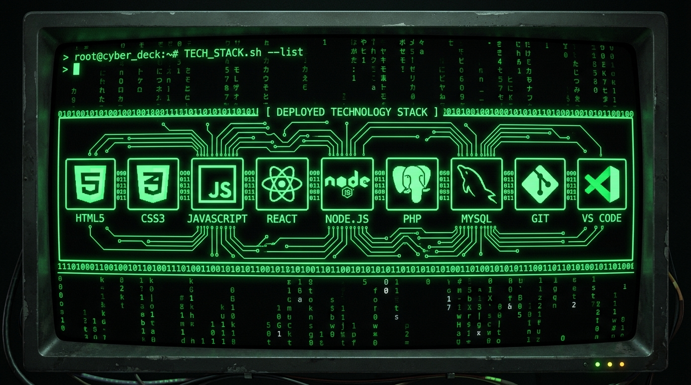

<div align="center">

<!-- ══════════════════════════════════════════════════════════════ -->
<!--              💀 MATRIX HEADER - HACKER THEME 💀              -->
<!-- ══════════════════════════════════════════════════════════════ -->


<!-- Typing SVG - Hacker Style -->


</div>

<br>

<!-- ══════════════════════════════════════════════════════════════ -->
<!--                  💻 MAIN HACKER BANNER 💻                    -->
<!-- ══════════════════════════════════════════════════════════════ -->
<div align="center">
  
</div>

<br>

<!-- ══════════════════════════════════════════════════════════════ -->
<!--                  📊 SYSTEM STATUS BADGES 📊                  -->
<!-- ══════════════════════════════════════════════════════════════ -->
<div align="center">


</div>

<br>

<!-- ══════════════════════════════════════════════════════════════ -->
<!--                   🔗 NETWORK CONNECTIONS 🔗                  -->
<!-- ══════════════════════════════════════════════════════════════ -->
<div align="center">
  <a href="https://github.com/SHEILPIAN">
    
  </a>
  &nbsp;
  <a href="mailto:selpian@vuteq.co.id">
    
  </a>
  &nbsp;
  <a href="#">
    
  </a>
  &nbsp;
  <a href="https://github.com/SHEILPIAN?tab=repositories">
    
  </a>
</div>

<br>

---

<!-- ══════════════════════════════════════════════════════════════ -->
<!--                 🖥️ WHOAMI — SYSTEM PROFILE 🖥️                -->
<!-- ══════════════════════════════════════════════════════════════ -->

## `> whoami` &nbsp; — &nbsp; System Profile

<table align="center">
  <tr>
    <td width="58%" valign="top">
      <br>

```bash
root@SHEILPIAN:~$ cat profile.json
{
  "name"     : "SHEILPIAN",
  "location" : "Indonesia [ID]",
  "company"  : "PT Vuteq Indonesia",
  "role"     : "Software Engineer / IT Developer",
  "status"   : "[ONLINE] Open to Collaborate",

  "skills": [
    "Industrial Automation Systems",
    "Full Stack Web Development",
    "Data Visualization & Reporting",
    "Process Digitalization & Kaizen",
    "IoT Integration & Smart Systems"
  ],

  "learning": [
    "Next.js & React Ecosystem",
    "Python for Automation & ML",
    "Cloud Infrastructure",
    "Embedded Systems / RPi"
  ],

  "uptime"   : "24/7",
  "kernel"   : "passion-driven-v4.1"
}
root@SHEILPIAN:~$ _
```

  <br>
    </td>
    <td width="42%" align="center" valign="middle">
      
    </td>
  </tr>
</table>

<br>

---

<!-- ══════════════════════════════════════════════════════════════ -->
<!--             ⚙️ TECH STACK — DEPLOYED MODULES ⚙️              -->
<!-- ══════════════════════════════════════════════════════════════ -->

## `> ls ./tech-stack/` &nbsp; — &nbsp; Deployed Modules

<div align="center">
  
</div>

<br>

### `> cat stack.conf`

<div align="center">

**[ FRONTEND_MODULES ]**


**[ BACKEND_MODULES ]**


**[ DATABASE_&_TOOLS ]**


</div>

<br>

---

<!-- ══════════════════════════════════════════════════════════════ -->
<!--            📊 SYSTEM ANALYTICS — GITHUB METRICS 📊           -->
<!-- ══════════════════════════════════════════════════════════════ -->

## `> ./analytics.sh --github` &nbsp; — &nbsp; System Metrics

<div align="center">
  
</div>

<br>

<div align="center">
  
  &nbsp;
  
</div>

<br>

<div align="center">
  
</div>

<br>

<div align="center">
  
</div>

<br>

---

<!-- ══════════════════════════════════════════════════════════════ -->
<!--            🚀 ACTIVE PROCESSES — FEATURED PROJECTS 🚀        -->
<!-- ══════════════════════════════════════════════════════════════ -->

## `> ps aux --projects` &nbsp; — &nbsp; Active Processes

<div align="center">

| `PID` | `PROCESS_NAME` | `DESCRIPTION` | `STACK` | `STATUS` |
|:---:|:---|:---|:---:|:---:|
| 001 | **DKM_Management.exe** | Sistem manajemen terpadu masjid — keuangan, kegiatan & anggota | PHP, MySQL, JS | `[RUNNING]` |
| 002 | **Checksheet_App.exe** | Digital checksheet monitoring proses produksi harian | React, Node.js | `[RUNNING]` |
| 003 | **Finance_Integration.sh** | Sistem integrasi metode pembayaran keuangan internal | PHP, MySQL | `[RUNNING]` |
| 004 | **Inventory_Sparepart.py** | Manajemen & tracking stok sparepart mesin produksi | PHP, MySQL, AJAX | `[RUNNING]` |

</div>

<br>

---

<!-- ══════════════════════════════════════════════════════════════ -->
<!--               👤 OPERATOR PROFILE — HACKER CARD 👤           -->
<!-- ══════════════════════════════════════════════════════════════ -->

## `> id --operator` &nbsp; — &nbsp; Operator Profile

<div align="center">
  
  <br><br>

```
╔══════════════════════════════════════════════════════════╗
║  > "The code doesn't lie. Debug it until it confesses."  ║
║                                          — SHEILPIAN     ║
╚══════════════════════════════════════════════════════════╝
```

  
  
  

</div>

<br>

---

<!-- ══════════════════════════════════════════════════════════════ -->
<!--            🔌 OPEN CONNECTIONS — CONTACT 🔌                  -->
<!-- ══════════════════════════════════════════════════════════════ -->

## `> netstat --open-connections`

<div align="center">

  <p><code>> Accepting new connections. Send your request...</code></p>

  <a href="mailto:selpian@vuteq.co.id">
    
  </a>
  &nbsp;
  <a href="https://github.com/SHEILPIAN">
    
  </a>

  <br><br>

  <!-- Matrix Footer -->
  

</div>

<!-- root@SHEILPIAN:~$ shutdown -h now -->
