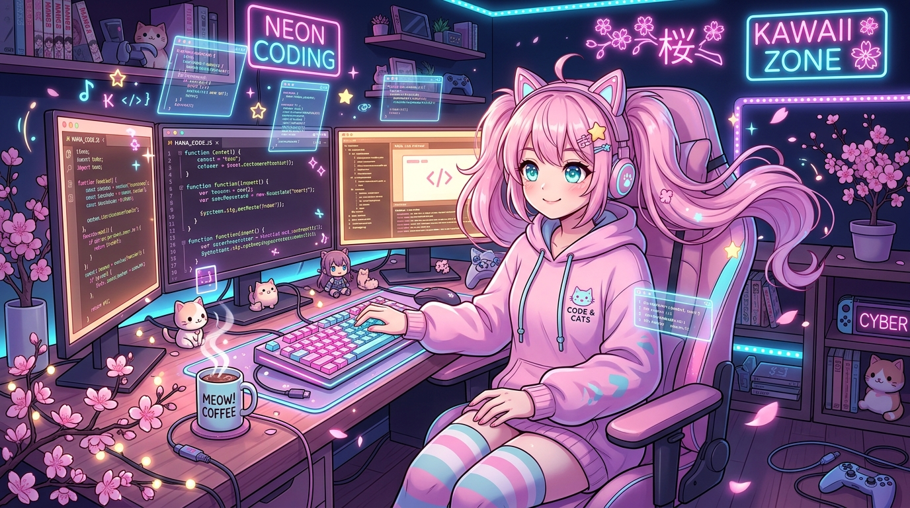
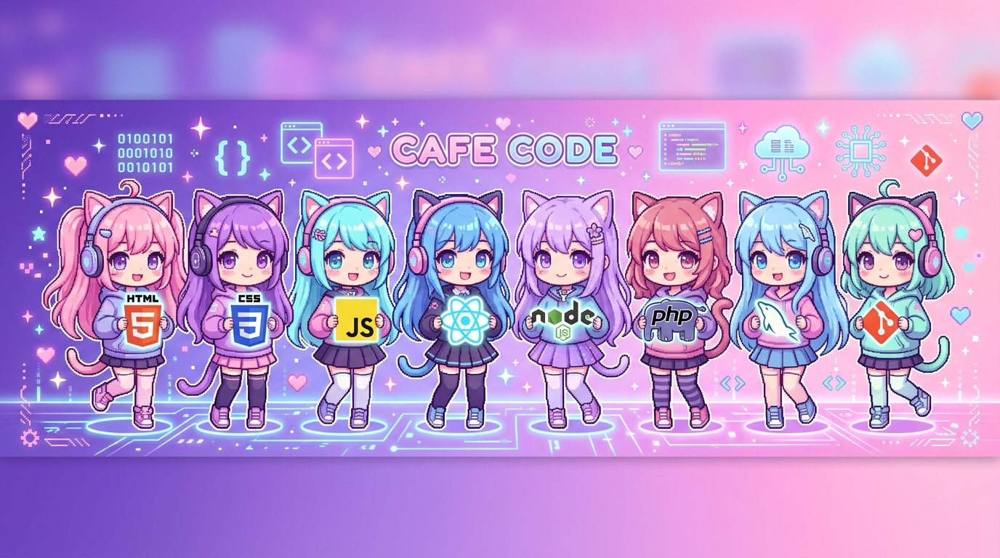
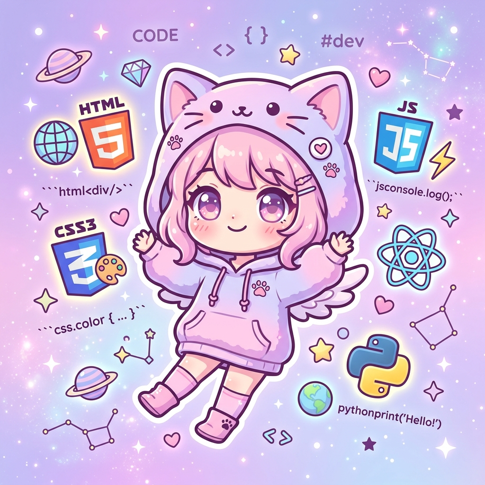

<div align="center">

<!-- ════════════════════════════════════════════════════════════ -->
<!--                  ✨ WAVE HEADER ✨                           -->
<!-- ════════════════════════════════════════════════════════════ -->


<!-- Animated Typing SVG -->


</div>

<br>

<!-- ════════════════════════════════════════════════════════════ -->
<!--                    🌸 MAIN BANNER 🌸                        -->
<!-- ════════════════════════════════════════════════════════════ -->
<div align="center">
  
</div>

<br>

<!-- ════════════════════════════════════════════════════════════ -->
<!--                  📊 QUICK STATS BADGES 📊                   -->
<!-- ════════════════════════════════════════════════════════════ -->
<div align="center">


</div>

<br>

<!-- ════════════════════════════════════════════════════════════ -->
<!--                   🔗 SOCIAL LINKS 🔗                        -->
<!-- ════════════════════════════════════════════════════════════ -->
<div align="center">
  <a href="https://github.com/SHEILPIAN">
    
  </a>
  &nbsp;
  <a href="mailto:selpian@vuteq.co.id">
    
  </a>
  &nbsp;
  <a href="#">
    
  </a>
  &nbsp;
  <a href="https://github.com/SHEILPIAN?tab=repositories">
    
  </a>
</div>

<br>

---

<!-- ════════════════════════════════════════════════════════════ -->
<!--                   🌸 ABOUT ME SECTION 🌸                    -->
<!-- ════════════════════════════════════════════════════════════ -->

##  &nbsp; About Me &nbsp; 🌸

<table align="center">
  <tr>
    <td width="60%" valign="top">
      <br>

```yaml
Name        : SHEILPIAN
Location    : 🇮🇩 Indonesia
Company     : PT Vuteq Indonesia
Role        : Software Engineer / IT Developer
Status      : 🟢 Open to Collaborate

Passions:
  - 🤖 Industrial Automation Systems
  - 🌐 Full Stack Web Development
  - 📊 Data Visualization & Reporting
  - ⚙️  Process Digitalization & Kaizen
  - 🔧 IoT Integration & Smart Systems

Currently Learning:
  - Next.js & React Ecosystem
  - Python for Automation & ML
  - Cloud Infrastructure
  - Embedded Systems / Raspberry Pi

Fun Fact : "I turn coffee ☕ and ideas 💡
           into systems that actually work!"
```

  <br>
    </td>
    <td width="40%" align="center" valign="middle">
      
    </td>
  </tr>
</table>

<br>

---

<!-- ════════════════════════════════════════════════════════════ -->
<!--               🛠️ SKILLS & TECHNOLOGIES 🛠️                   -->
<!-- ════════════════════════════════════════════════════════════ -->

## 🛠️ &nbsp; Languages & Technologies

<div align="center">
  
</div>

<br>

### 💻 Tech Stack

<div align="center">

**⟨ Frontend ⟩**


**⟨ Backend ⟩**


**⟨ Database & Tools ⟩**


</div>

<br>

---

<!-- ════════════════════════════════════════════════════════════ -->
<!--              📈 GITHUB STATS & ANALYTICS 📈                  -->
<!-- ════════════════════════════════════════════════════════════ -->

## 📈 &nbsp; GitHub Analytics

<div align="center">
  
</div>

<br>

<div align="center">
  
  &nbsp;
  
</div>

<br>

<div align="center">
  
</div>

<br>

<div align="center">
  
</div>

<br>

---

<!-- ════════════════════════════════════════════════════════════ -->
<!--              🚀 FEATURED PROJECTS 🚀                         -->
<!-- ════════════════════════════════════════════════════════════ -->

## 🚀 &nbsp; Featured Projects

<div align="center">

| 🌸 Project | 📝 Description | 🛠️ Stack | 🔗 Link |
|:---:|:---|:---:|:---:|
| 🏭 **DKM Management** | Sistem manajemen terpadu masjid — keuangan, kegiatan & anggota | PHP, MySQL, JS | [Repo](https://github.com/SHEILPIAN) |
| 📋 **Checksheet App** | Digital checksheet monitoring proses produksi harian | React, Node.js | [Repo](https://github.com/SHEILPIAN) |
| 💰 **Finance Integration** | Sistem integrasi metode pembayaran keuangan internal | PHP, MySQL | [Repo](https://github.com/SHEILPIAN) |
| ⚙️ **Inventory Sparepart** | Manajemen & tracking stok sparepart mesin produksi | PHP, MySQL, AJAX | [Repo](https://github.com/SHEILPIAN) |

</div>

<br>

---

<!-- ════════════════════════════════════════════════════════════ -->
<!--                  🌸 DEVELOPER SPIRIT 🌸                     -->
<!-- ════════════════════════════════════════════════════════════ -->

## 🌸 &nbsp; Developer Spirit

<div align="center">
  
  <br><br>

  > *"Every line of code is a step towards making the world work better — one commit at a time."* ✨

  <br>

  
  
  

</div>

<br>

---

<!-- ════════════════════════════════════════════════════════════ -->
<!--               🤝 CONNECT WITH ME 🤝                         -->
<!-- ════════════════════════════════════════════════════════════ -->

## 🤝 &nbsp; Let's Connect!

<div align="center">

  <p>Feel free to reach out for collaborations, projects, or just to say <b>Konnichiwa!</b> 🌸</p>

  <a href="mailto:selpian@vuteq.co.id">
    
  </a>
  &nbsp;
  <a href="https://github.com/SHEILPIAN">
    
  </a>

  <br><br>

  <!-- Wave Footer -->
  

</div>

<!-- Made with 💖 by SHEILPIAN -->
