<div align="center">


<br>

```text
╔═══════════════════════════════════════════════════════════╗
║  > "The code doesn't lie. Debug it until it confesses."   ║
║                                              — SHEILPIAN  ║
╚═══════════════════════════════════════════════════════════╝
```


<br>

<a href="https://github.com/SHEILPIAN"></a>
<a href="mailto:selpian@vuteq.co.id"></a>
<a href="#"></a>
<a href="https://github.com/SHEILPIAN?tab=repositories"></a>

</div>

---

## `> whoami` — System Profile

<table>
<tr>
<td width="56%" valign="top">

```bash
root@kali:~/SHEILPIAN$ cat profile.json
{
  "name"     : "SHEILPIAN",
  "location" : "Indonesia [ID]",
  "company"  : "PT Vuteq Indonesia",
  "role"     : "Software Engineer / IT Developer",
  "status"   : "[ONLINE] Open to Collaborate",
  "skills"   : [
    "Industrial Automation Systems",
    "Full Stack Web Development",
    "Data Visualization & Reporting",
    "Process Digitalization & Kaizen",
    "IoT Integration & Smart Systems"
  ],
  "learning" : [
    "Next.js & React Ecosystem",
    "Python for Automation & ML",
    "Cloud Infrastructure",
    "Embedded Systems / RPi"
  ],
  "uptime"   : "24/7",
  "kernel"   : "passion-driven-v4.1",
  "distro"   : "Kali Linux Rolling"
}
root@kali:~/SHEILPIAN$ _
```

</td>
<td width="44%" align="center" valign="middle">

</td>
</tr>
</table>

---

## `> ls ./tech-stack/` — Deployed Modules



### `> cat stack.conf`

<div align="center">

**[ FRONTEND_MODULES ]**


**[ BACKEND_MODULES ]**


**[ DATABASE_&_TOOLS ]**


</div>

---

## `> ./analytics.sh --github` — System Metrics

<div align="center">


</div>

---

## `> ps aux --projects` — Active Processes

<div align="center">

| `PID` | `PROCESS_NAME` | `DESCRIPTION` | `STACK` | `STATUS` |
|:---:|:---|:---|:---:|:---:|
| 001 | **DKM_Management.exe** | Sistem manajemen terpadu masjid — keuangan, kegiatan & anggota | PHP, MySQL, JS | `[RUNNING]` |
| 002 | **Checksheet_App.exe** | Digital checksheet monitoring proses produksi harian | React, Node.js | `[RUNNING]` |
| 003 | **Finance_Integration.sh** | Sistem integrasi metode pembayaran keuangan internal | PHP, MySQL | `[RUNNING]` |
| 004 | **Inventory_Sparepart.py** | Manajemen & tracking stok sparepart mesin produksi | PHP, MySQL, AJAX | `[RUNNING]` |

</div>


---

## `> netstat --open-connections`

<div align="center">

`> Accepting new connections. Send your request...`

<a href="mailto:selpian@vuteq.co.id"></a>
<a href="https://github.com/SHEILPIAN"></a>


</div>

<!-- root@SHEILPIAN:~$ shutdown -h now -->
